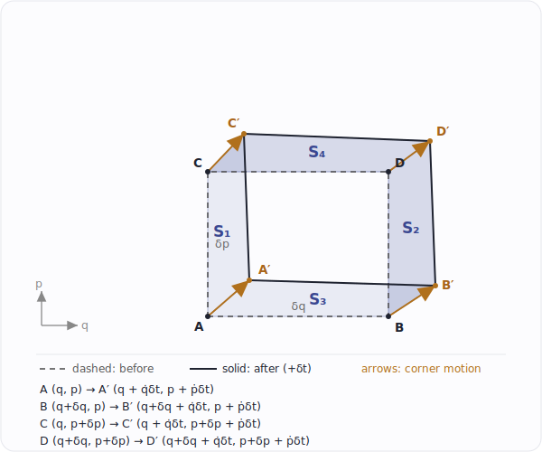

# 刘维尔定理

> 手写笔记整理稿。内容为哈密顿系统中相空间密度守恒定理的两种证明。

---

## 1. 引言

在哈密顿力学中，一个系统的完整状态由广义坐标 $q$ 和广义动量 $p$ 共同确定，它们张成的空间称为**相空间**。系统随时间的演化对应相空间中的一条轨迹。

在统计力学中，我们往往不关心单个系统，而关心大量全同系统构成的**系综**。此时用**相空间密度** $\rho(t, q, p)$ 描述系综在相空间中的分布：$\rho\,dq\,dp$ 表示 $t$ 时刻落在相空间体积元 $dq\,dp$ 内的系统数（比例）。

**刘维尔定理**断言：随系统沿哈密顿流一起运动时，相空间密度保持不变；等价地，相空间体积元在演化中保持不变。直观图像是——相空间中的"概率流体"是**不可压缩的**。

下面用两种独立方法给出证明。它们出自笔记的两页，本质上是同一事实的两个侧面。

---

## 2. 预备：哈密顿方程

设系统的哈密顿量为 $H(q, p)$（可含时，记为 $H(t,q,p)$ 也不影响推导）。运动方程即**哈密顿正则方程**：

$$
\dot q = \frac{\partial H}{\partial p}, \qquad \dot p = -\frac{\partial H}{\partial q}.
$$

定义相空间中的"**速度场**"：

$$
\vec v \equiv (\dot q,\ \dot p) = \left(\frac{\partial H}{\partial p},\ -\frac{\partial H}{\partial q}\right).
$$

相空间中的散度算子为 $\nabla \equiv \left(\dfrac{\partial}{\partial q},\ \dfrac{\partial}{\partial p}\right)$。

---

## 3. 定理陈述

刘维尔定理有两种等价表述：

- **沿轨迹密度守恒：**
$$
\frac{d\rho}{dt} = 0.
$$

- **相空间体积守恒：** 若某个（正则）变换把 $(q,p)$ 映为 $(Q,P)$，则
$$
dQ\,dP = dq\,dp.
$$

**证明一**（连续性方程法）证明第一种表述；**证明二**（几何面积法）与**证明四**（正则变换法）从不同角度证明第二种表述（**证明三**待补）。

---

## 4. 证明一：连续性方程法

> 对应笔记第 1 张图。把系综看作相空间中的流体，用流体守恒（连续性方程）的语言推导。

### 4.1 连续性方程（物理前提）

系综中系统的总数守恒——代表点既不产生也不消灭。对相空间中任一固定区域，其内部系统数的减少率等于经边界流出的净通量；用散度定理化为微分形式，便得到相空间中的**连续性方程**：

$$
\boxed{\ \frac{\partial \rho}{\partial t} + \nabla\cdot(\rho\vec v) = 0\ }
\tag{4.1}
$$

它与流体力学中的质量守恒方程形式完全一致，是本证明的**物理出发点**——来自"系统数守恒"这一物理事实，而非由代数推导得来。

为便于后面代入，把带密度的通量散度用乘积法则展开成一个恒等式：

$$
\nabla\cdot(\rho\vec v)
= \frac{\partial}{\partial q}\big(\rho\,\dot q\big)
+ \frac{\partial}{\partial p}\big(\rho\,\dot p\big)
= \underbrace{\left(\frac{\partial \rho}{\partial q}\dot q + \frac{\partial \rho}{\partial p}\dot p\right)}_{(\vec v\cdot\nabla)\rho}
+ \rho\underbrace{\left(\frac{\partial \dot q}{\partial q} + \frac{\partial \dot p}{\partial p}\right)}_{\nabla\cdot\vec v}.
$$

### 4.2 关键引理：相流无散度

计算相空间速度场的散度，代入哈密顿方程：

$$
\nabla\cdot\vec v
= \frac{\partial \dot q}{\partial q} + \frac{\partial \dot p}{\partial p}
= \frac{\partial}{\partial q}\!\left(\frac{\partial H}{\partial p}\right)
+ \frac{\partial}{\partial p}\!\left(-\frac{\partial H}{\partial q}\right)
= \frac{\partial^2 H}{\partial q\,\partial p} - \frac{\partial^2 H}{\partial p\,\partial q}.
$$

只要 $H$ 二阶偏导连续，混合偏导可交换次序（Clairaut/Schwarz 定理），故

$$
\boxed{\ \nabla\cdot\vec v = 0\ }
\tag{4.2}
$$

**这是全部证明的核心**：哈密顿流是无散度的，相空间"流体"不可压缩。

### 4.3 收尾：代回并展开全导数

把引理 (4.2) $\nabla\cdot\vec v = 0$ 代入 4.1 节的恒等式，第二项为零，于是 $\nabla\cdot(\rho\vec v) = (\vec v\cdot\nabla)\rho$。再代回连续性方程 (4.1)：

$$
\frac{\partial \rho}{\partial t}
= -\,\nabla\cdot(\rho\vec v)
= -\,\vec v\cdot\nabla\rho
= -\frac{\partial \rho}{\partial q}\dot q - \frac{\partial \rho}{\partial p}\dot p .
$$

到这一步才引入**全导数展开**：密度 $\rho(t,q,p)$ 沿一条轨迹的全时间导数为

$$
\frac{d\rho}{dt}
= \frac{\partial \rho}{\partial t}
+ \frac{\partial \rho}{\partial q}\dot q
+ \frac{\partial \rho}{\partial p}\dot p .
$$

把上面得到的 $\partial\rho/\partial t$ 代入，两组项恰好相消：

$$
\frac{d\rho}{dt}
= \left(-\frac{\partial \rho}{\partial q}\dot q - \frac{\partial \rho}{\partial p}\dot p\right)
+ \frac{\partial \rho}{\partial q}\dot q
+ \frac{\partial \rho}{\partial p}\dot p
= 0 .
\qquad\blacksquare
$$

**结论**：随流一起运动的观察者看到的局部密度恒定，$d\rho/dt = 0$。

---

## 5. 证明二：时间演化下相空间面积不变（几何面积法）

> 对应笔记 5 张图。不借助雅可比行列式，直接追踪一个无穷小面积元的四个顶点在哈密顿流下的运动，用初等的"边界条带面积"算出面积改变量，证明它为零。

### 5.1 无穷小面积元的顶点演化

在相空间取一个无穷小矩形，四顶点为

$$
A=(q,\ p),\quad
B=(q+\delta q,\ p),\quad
C=(q,\ p+\delta p),\quad
D=(q+\delta q,\ p+\delta p),
$$

面积为 $\delta q\,\delta p$。经过无穷小时间 $dt$，每个相点按哈密顿流移动

$$
(q,\ p)\ \longrightarrow\ \big(q+\dot q(q,p)\,dt,\ \ p+\dot p(q,p)\,dt\big),
\qquad
\dot q=\frac{\partial H}{\partial p},\quad \dot p=-\frac{\partial H}{\partial q}.
$$

由于速度场 $(\dot q,\dot p)$ 随位置变化，四个顶点的位移各不相同，矩形被拉成一个（曲边）平行四边形。四顶点分别映为

$$
\begin{aligned}
A&\longrightarrow\big(q+\dot q(q,p)\,dt,\ \ p+\dot p(q,p)\,dt\big),\\
B&\longrightarrow\big(q+\delta q+\dot q(q+\delta q,p)\,dt,\ \ p+\dot p(q+\delta q,p)\,dt\big),\\
C&\longrightarrow\big(q+\dot q(q,p+\delta p)\,dt,\ \ p+\delta p+\dot p(q,p+\delta p)\,dt\big),\\
D&\longrightarrow\big(q+\delta q+\dot q(q+\delta q,p+\delta p)\,dt,\ \ p+\delta p+\dot p(q+\delta q,p+\delta p)\,dt\big).
\end{aligned}
$$

### 5.2 用边界条带算面积改变量

*图.* 无穷小面积元 $\delta q\times\delta p$（黑框）及其四条边界条带：$S_1,S_2$（左、右）来自沿 $q$ 方向的位移 $\dot q\,dt$；$S_3,S_4$（下、上）来自沿 $p$ 方向的位移 $\dot p\,dt$。前进边（右、上）扫出的面积记正，后退边（左、下）记负。

把演化后的面积写成"原矩形面积 $+$ 四条边界条带的净贡献"。记左、右、下、上四条边随流扫过的条带面积为 $S_1,S_2,S_3,S_4$（对应笔记图中的标注），面积改变量为

$$
\Delta S=(S_2-S_1)+(S_4-S_3).
$$

**水平方向（左、右两条竖直边）。** 右边（在 $q+\delta q$ 处）与左边（在 $q$ 处）沿 $q$ 方向的位移分别是 $\dot q(q+\delta q,p)\,dt$ 与 $\dot q(q,p)\,dt$；两者之差乘以竖直边长 $\delta p$，即为右、左条带的面积差

$$
S_2-S_1
=\big[\dot q(q+\delta q,p)-\dot q(q,p)\big]\,dt\,\cdot\,\delta p
=\frac{\partial \dot q}{\partial q}\,\delta q\,\delta p\,dt+O(\delta q^{2}).
$$

**竖直方向（上、下两条水平边）。** 同理，上边（在 $p+\delta p$ 处）与下边（在 $p$ 处）沿 $p$ 方向的位移之差乘以水平边长 $\delta q$

$$
S_4-S_3
=\big[\dot p(q,p+\delta p)-\dot p(q,p)\big]\,dt\,\cdot\,\delta q
=\frac{\partial \dot p}{\partial p}\,\delta p\,\delta q\,dt+O(\delta p^{2}).
$$

> 笔记中把每条条带当作梯形，用梯形面积公式逐项展开（第 4、5 张图），结果与上面的领头阶完全一致；更高阶的 $O(dt^{2})$、$O(\delta^{3})$ 项可略去。

### 5.3 散度为零：面积不变

两式相加：

$$
\Delta S=(S_2-S_1)+(S_4-S_3)
=\left(\frac{\partial \dot q}{\partial q}+\frac{\partial \dot p}{\partial p}\right)\delta q\,\delta p\,dt
=(\nabla\cdot\vec v)\,\delta q\,\delta p\,dt.
$$

代入哈密顿方程 $\dot q=\partial H/\partial p$、$\dot p=-\partial H/\partial q$，括号内正是相流散度，而

$$
\frac{\partial \dot q}{\partial q}+\frac{\partial \dot p}{\partial p}
=\frac{\partial^{2} H}{\partial q\,\partial p}-\frac{\partial^{2} H}{\partial p\,\partial q}=0,
$$

故

$$
\boxed{\ \Delta S=0\ }.
$$

即演化后面积仍为 $\delta q\,\delta p$。对有限时间，把无穷小步逐次相乘，面积恒保持不变。 $\blacksquare$

这与**证明四**（正则变换／雅可比）是同一结论的两种视角：那里算 $\det J=1+(\nabla\cdot\vec v)\,dt$，这里算 $\Delta S=(\nabla\cdot\vec v)\,\delta q\,\delta p\,dt$——本质都是 $\nabla\cdot\vec v=0$。

---

## 6. 证明三（待补）

> 此处留待你补充下一个证明。

---

## 7. 证明四：正则变换下的体积不变性

> 对应笔记第 2、3 张图。**先证明一般正则变换保持相空间体积**，再把时间演化作为无穷小正则变换的特例联系回来。

### 7.1 正则变换保持相空间体积

考虑一个变换 $(q,p)\to(Q,P)$。所谓**正则变换**，是指在新变量下运动方程仍保持哈密顿形式：

$$
\dot Q = \frac{\partial H}{\partial P},
\qquad
\dot P = -\frac{\partial H}{\partial Q}.
$$

新旧体积元由雅可比行列式联系：

$$
dQ\,dP = \left|\frac{\partial(Q,P)}{\partial(q,p)}\right|\,dq\,dp,
\qquad
\frac{\partial(Q,P)}{\partial(q,p)}
= \frac{\partial Q}{\partial q}\frac{\partial P}{\partial p}
- \frac{\partial Q}{\partial p}\frac{\partial P}{\partial q}
\equiv \{Q, P\},
$$

其中最后一步认出这正是 $Q$、$P$ 的**泊松括号** $\{Q,P\}$。因此只要证明 $\{Q,P\}=1$，就有 $dQ\,dP = dq\,dp$。

**证明 $\{Q,P\}=1$**（笔记所用思路：把新变量的时间导数用链式法则展开，再对照它满足的哈密顿方程）。

一方面，$Q=Q(q,p)$ 沿轨迹的时间导数由链式法则给出，再代入旧变量的哈密顿方程：

$$
\dot Q
= \frac{\partial Q}{\partial q}\dot q + \frac{\partial Q}{\partial p}\dot p
= \frac{\partial Q}{\partial q}\frac{\partial H}{\partial p}
- \frac{\partial Q}{\partial p}\frac{\partial H}{\partial q}.
\tag{7.1}
$$

另一方面，把 $H$ 看作新变量 $(Q,P)$ 的函数，用链式法则展开 $\partial H/\partial P$：

$$
\frac{\partial H}{\partial P}
= \frac{\partial H}{\partial q}\frac{\partial q}{\partial P}
+ \frac{\partial H}{\partial p}\frac{\partial p}{\partial P}.
\tag{7.2}
$$

正则变换要求 (7.1) = (7.2)，即 $\dot Q = \partial H/\partial P$。由于该式须对任意哈密顿量 $H$ 成立，比较 $\partial H/\partial q$ 与 $\partial H/\partial p$ 的系数，得到变换的两组关系：

$$
\frac{\partial Q}{\partial p} = -\frac{\partial q}{\partial P},
\qquad
\frac{\partial Q}{\partial q} = \frac{\partial p}{\partial P}.
\tag{7.3}
$$

同理，对 $\dot P = -\partial H/\partial Q$ 做相同处理，得到

$$
\frac{\partial P}{\partial p} = \frac{\partial q}{\partial Q},
\qquad
\frac{\partial P}{\partial q} = -\frac{\partial p}{\partial Q}.
\tag{7.4}
$$

把 (7.3)、(7.4) 代入雅可比：

$$
\{Q,P\}
= \frac{\partial Q}{\partial q}\frac{\partial P}{\partial p}
- \frac{\partial Q}{\partial p}\frac{\partial P}{\partial q}
= \frac{\partial p}{\partial P}\frac{\partial q}{\partial Q}
- \left(-\frac{\partial q}{\partial P}\right)\!\left(-\frac{\partial p}{\partial Q}\right)
= \frac{\partial q}{\partial Q}\frac{\partial p}{\partial P}
- \frac{\partial q}{\partial P}\frac{\partial p}{\partial Q}.
$$

最右边恰是逆变换的雅可比 $\dfrac{\partial(q,p)}{\partial(Q,P)}$。而正逆两个雅可比互为倒数：

$$
\{Q,P\} = \frac{\partial(Q,P)}{\partial(q,p)},
\qquad
\frac{\partial(q,p)}{\partial(Q,P)} = \left(\frac{\partial(Q,P)}{\partial(q,p)}\right)^{-1},
$$

故 $\{Q,P\} = \{Q,P\}^{-1}$，即 $\{Q,P\}^2 = 1$。取与恒等变换连续相连的分支 $\{Q,P\}=+1$。于是

$$
\boxed{\ \{Q,P\} = 1\ } \quad\Longrightarrow\quad \boxed{\ dQ\,dP = dq\,dp\ }.
$$

**这就是正则变换下相空间体积不变性**：任何正则变换都保持相空间体积元。

> 用矩阵语言，正则变换的雅可比矩阵 $J$ 满足**辛条件** $J^{\mathsf T}\Omega J = \Omega$，其中
> $\Omega = \begin{pmatrix}0&1\\-1&0\end{pmatrix}$ 是辛形式。两边取行列式即得 $(\det J)^2 = 1$，与上面结论一致。

### 7.2 时间演化是无穷小正则变换

时间演化本身就是一族单参数正则变换：经过无穷小时间 $dt$，相点按哈密顿方程移动

$$
(q,\ p)\ \longrightarrow\ (Q,\ P)
= \left(\,q + \frac{\partial H}{\partial p}\,dt,\ \ p - \frac{\partial H}{\partial q}\,dt\,\right)
= (q + \dot q\,dt,\ \ p + \dot p\,dt).
$$

由 7.1 节的一般结论，它必然保持体积。也可以直接验证——计算此映射的雅可比并展开到 $O(dt)$：

$$
\frac{\partial Q}{\partial q} = 1 + \frac{\partial \dot q}{\partial q}\,dt,
\quad
\frac{\partial Q}{\partial p} = \frac{\partial \dot q}{\partial p}\,dt,
\quad
\frac{\partial P}{\partial q} = \frac{\partial \dot p}{\partial q}\,dt,
\quad
\frac{\partial P}{\partial p} = 1 + \frac{\partial \dot p}{\partial p}\,dt,
$$

于是

$$
\det J
= \left(1 + \frac{\partial \dot q}{\partial q}dt\right)\!\left(1 + \frac{\partial \dot p}{\partial p}dt\right)
- \left(\frac{\partial \dot q}{\partial p}dt\right)\!\left(\frac{\partial \dot p}{\partial q}dt\right)
= 1 + \left(\frac{\partial \dot q}{\partial q} + \frac{\partial \dot p}{\partial p}\right)dt + O(dt^2).
$$

括号里正是相流的散度 $\nabla\cdot\vec v$，而证明一已证 $\nabla\cdot\vec v = 0$，故

$$
\boxed{\ \det J = 1 + (\nabla\cdot\vec v)\,dt + O(dt^2) = 1\ }
\quad\Longrightarrow\quad
dQ\,dP = dq\,dp .
\qquad\blacksquare
$$

对有限时间，只需把无穷小步连乘，行列式仍恒为 1。这既与 7.1 节的正则变换结论一致，也把证明四接回了证明一：**"散度为零"与"雅可比为一"是同一件事的一阶体现**。

---

## 8. 泊松括号形式

引入**泊松括号**

$$
\{A, B\} \equiv \frac{\partial A}{\partial q}\frac{\partial B}{\partial p} - \frac{\partial A}{\partial p}\frac{\partial B}{\partial q},
$$

则证明一 4.3 节的结果可写成紧凑的**刘维尔方程**：

$$
\frac{\partial \rho}{\partial t}
= -\frac{\partial \rho}{\partial q}\frac{\partial H}{\partial p} + \frac{\partial \rho}{\partial p}\frac{\partial H}{\partial q}
= \{H, \rho\}.
$$

> 符号约定：在 $\{A,B\}=\partial_q A\,\partial_p B - \partial_p A\,\partial_q B$ 下，$\partial\rho/\partial t = \{H,\rho\} = -\{\rho,H\}$。不同教材的符号可能相差一个负号，请以所用泊松括号定义为准。

这与量子力学中密度算符 $\hat\rho$ 满足的 **von Neumann 方程**

$$
i\hbar\,\frac{\partial \hat\rho}{\partial t} = [\hat H, \hat\rho]
$$

一一对应——经典泊松括号 $\{\cdot,\cdot\}$ 对应量子对易子 $\tfrac{1}{i\hbar}[\cdot,\cdot]$，这是经典—量子对应的一个典型体现。

---

## 9. 物理意义

- **不可压缩相流：** $\nabla\cdot\vec v = 0$ 意味着代表点构成的"流体"既不被压缩也不膨胀。一团初始占据面积 $A$ 的相点，演化后形状可以被强烈拉伸、扭曲（如笔记第 3 张图所画的平行四边形变形），但**面积/体积始终保持 $A$ 不变**。

- **系综演化：** 密度沿轨迹守恒 $d\rho/dt=0$，保证了用相空间密度描述统计系综的自洽性——概率既不会凭空产生也不会消失。

- **统计力学基础：** 刘维尔定理是**微正则系综**中"等概率假设"的动力学依据：在能量壳层上均匀的密度分布 $\rho = \text{const}$ 是刘维尔方程的定态解（$\partial\rho/\partial t = 0$），因而是自然的平衡态分布。

- **各证明的统一：** 证明一的核心 $\nabla\cdot\vec v = 0$、证明二的面积改变量 $\Delta S=(\nabla\cdot\vec v)\,\delta q\,\delta p\,dt$ 与证明四的 $\det J = 1$ **本质是同一件事**——因为雅可比行列式展开到一阶恰为
$$
\det J = 1 + (\nabla\cdot\vec v)\,dt + O(dt^2),
$$
散度为零 $\iff$ 一阶体积变化率为零 $\iff$ 体积守恒。前者是微分（局部、瞬时）视角，后者是积分（整体、有限步）视角，二者互为表里。

---

### 附：符号表

| 符号 | 含义 |
|---|---|
| $q,\ p$ | 广义坐标、广义动量 |
| $H(t,q,p)$ | 哈密顿量 |
| $\rho(t,q,p)$ | 相空间密度 |
| $\vec v = (\dot q,\dot p)$ | 相空间速度场 |
| $\nabla\cdot\vec v$ | 相流散度 |
| $J,\ \det J$ | 雅可比矩阵与其行列式 |
| $\{A,B\}$ | 泊松括号 |
| $(Q,P)$ | 演化后 / 变换后的正则变量 |

---

*英文版见 `liouville-theorem.en.md`。*
